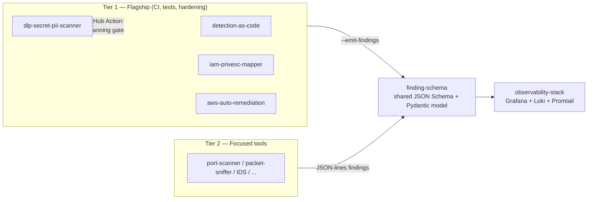

# Hi, I'm João Machado (John-Axe)

**Detection & Response Engineer** — currently a DART Intern @ Roblox (San Mateo, CA). I build detection pipelines, tune SIEM correlation rules, and investigate threats end-to-end. On GitHub, I build security tooling that's actually wired together: a shared finding schema, an observability stack, and tools that feed it.

- 🔎 **Now:** DART Intern @ Roblox (Feb 2026–Present)
- 🛡️ **Previously:** Security Operations Specialist @ Computer Information Station — alert triage, threat investigations, and NIDS deployments in an enterprise environment supporting 3,000+ users
- 🎓 Information Technology Certificate, Year Up United (expected July 2026)
- 📍 San Francisco Bay Area — open to remote/hybrid security operations & detection engineering roles

---

## The Security Engineering Ecosystem

Most project portfolios are a folder of unrelated scripts. Mine is deliberately integrated: **every tool emits findings in one shared schema, and one dashboard renders them all.**

**What makes it real, not narrative:**

- [`finding-schema`](https://github.com/John-Axe/finding-schema) — a miniature OCSF/Security-Hub-style finding shape (`id`, `source`, `severity`, `category`, `mitre_attack`, `owasp`, `remediation`, `raw`). One dashboard, no bespoke parsers.
- [`observability-stack`](https://github.com/John-Axe/observability-stack) — $0-cost local Grafana + Loki + Promtail (docker-compose) ingesting every tool's findings into a single "Findings Overview" dashboard.
- Integration is verified end-to-end with **real tool output** — a fixture secret from the DLP scanner and a real 16-finding IAM privilege-escalation scan — validated against the shared Pydantic model, not synthetic data.
- **Cost discipline:** everything runs free/local via LocalStack + docker-compose. The one real AWS deployment was recorded, torn down, and cost under $2.

## Flagship Projects

| Repo | What it is |
|---|---|
| [`dlp-secret-pii-scanner`](https://github.com/John-Axe/dlp-secret-pii-scanner) | Secret/PII scanner with CI, pre-commit hook, benchmarks, fuzzing, and a reusable GitHub Action used as the secret-scanning gate across my other flagship repos |
| [`detection-as-code`](https://github.com/John-Axe/detection-as-code) | Sigma detection rules with a test suite and OpenSSF Scorecard hardening |
| [`iam-privesc-mapper`](https://github.com/John-Axe/iam-privesc-mapper) | Builds an IAM privilege-escalation graph from Terraform/account data; fuzz-tested, in active development |
| [`aws-auto-remediation`](https://github.com/John-Axe/aws-auto-remediation) | Terraform-defined Lambda + EventBridge auto-remediation with CI and lockfile automation |

**Tier 2 — focused single-purpose tools** (8 of 10 emit findings in the shared schema): [`port-scanner`](https://github.com/John-Axe/port-scanner), [`packet-sniffer`](https://github.com/John-Axe/packet-sniffer), [`intrusion-detection-system`](https://github.com/John-Axe/intrusion-detection-system) (consumes the first two), [`firewall-simulator`](https://github.com/John-Axe/firewall-simulator), [`file-integrity-monitor`](https://github.com/John-Axe/file-integrity-monitor), [`keylogger-detector`](https://github.com/John-Axe/keylogger-detector), [`web-vuln-scanner`](https://github.com/John-Axe/web-vuln-scanner), [`phishing-detector`](https://github.com/John-Axe/phishing-detector) — plus two standalone crypto/auth demonstrations: [`encrypted-chat`](https://github.com/John-Axe/encrypted-chat) (RSA-2048 + AES-256-GCM) and [`password-cracker`](https://github.com/John-Axe/password-cracker) (dictionary / brute-force / rainbow-table).

## Skills

**Detection & Response:** SIEM correlation rule tuning (detection-as-code), alert triage across EDR and NIDS platforms, end-to-end threat investigations, threat hunting, SOAR automation & playbooks, digital forensics, NIDS sensor deployment

**Engineering:** Python (Pydantic, fuzzing, benchmarking), Sigma rules, Terraform, AWS (Lambda, EventBridge, LocalStack), Docker Compose, Grafana/Loki/Promtail, GitHub Actions & CI hardening (OpenSSF Scorecard), JSON Schema design

**Languages:** English (native) · Portuguese (native/bilingual) · Spanish (conversational)

## Stats

## Contact

- 💼 LinkedIn: [linkedin.com/in/jplmachado](https://linkedin.com/in/jplmachado)
- 🌐 Portfolio: Next.js/React site deployed on Vercel — see the [`v0-cybersecurity-portfolio`](https://github.com/John-Axe/v0-cybersecurity-portfolio) repo
